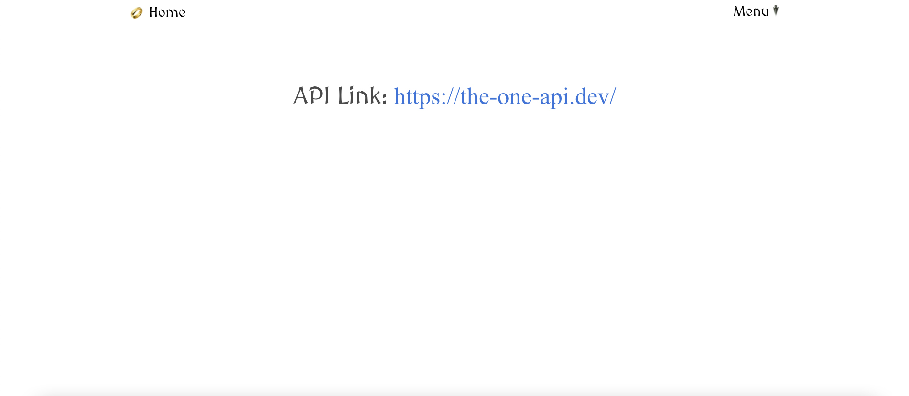

# General Assembly Project 2: Lord of the Rings Quiz

----
# Group Members:
* Justine Solano: https://github.com/justinesolano
* Jonty Ward: https://github.com/jonty-ward

# Table of Contents
* Project Brief
* Project Description
* Technologies & Installation
* Process
   - Planning
   - Frontend
* Final Walkthrough
* Wins & bugs
* Extra Features
​
## Project Brief:
* **Consume a public API** – this could be anything but it must make sense for your project.
* **Have several components**
* **The app can have a router** - with several "pages", this is up to you and if it makes sense for your project.
* **Include wireframes** - that you designed before building the app.
* **Be deployed online** and accessible to the public (hosted on your public github, not GA github!)
​
## Timeframe:
2 Days
 
## Description:
The Lord of the Rings Quiz App allows you to play two quizzes - the first a 'Guess Which Character Said' quotes quiz, and the second a 'Guess Which Movie This Quote Is From' quiz that only covers the LotR movie trilogy. There are 20 questions for each quiz with four answers and you score a point when you get a question right. The player gets a different LotR gif depending on their quiz score.
 
### Deployed version:
https://lotrquiz-app.netlify.app

## Technologies used
### API:
https://the-one-api.dev/

### Frontend:
- React
- Axios
- Bulma
- SASS
- React Router DOM

### Development tools:
- VSCode
- Insomnia
- Yarn
- Git & GitHub
- Google Chrome development tools
- Adobe Photoshop 2021 (wireframes)
- Fontmeme.com (logo and titles)
- Icons8.com (LotR character icons)
- Netlify (deployment)

## Installation
Clone or download sei-project-two repo then run these in Terminal:
* `yarn` to install yarn packages
* `yarn start` to run localhost in browser

 # PROCESS
## PLANNING (day 1)
### Concept
Jonty and I wanted to do something fun so we decided to create a quiz app. We both decided on a Lord of the Rings themed quiz because we both love the trilogy. It was only a 2-day hackathon so we kept our scope tight and doable. We decided to do 3 quizzes as the API we used provided a handful of routes that were useful for different quizzes such as /character, /book, /quotes, /movies.

### Wireframes


We decided to do a quiz for ‘guess the character who said this quote’ and a ‘guess what movie this quote is from’ quiz. We also wanted to do a main character quiz where the question would select a random trilogy main character and the player would have to choose a quote that the character said during the three films.

## FRONTEND (day 1 & 2)
After being signed off, we started on the first quiz. We used two endpoints here: /character, and /quote.

```javascript

  const [quotes, setQuotes] = useState(null)
  const [characters, setCharacters] = useState(null)
  const [movie, setMovie] = useState(null)

  useEffect(()=>{
    const getData = async () =>{
      try {
        const response = await axios.get('https://the-one-api.dev/v2/character', 
          {
            headers: {
              Authorization: `Bearer ${token}`,
            },
          })
        setCharacters(response.data.docs)
      } catch (err) {
        setErrors('This page is broken, try again later!')
      }
    }
    getData()
  }, [])

  useEffect(()=>{
    const getData = async () =>{
      try {
        const response = await axios.get('https://the-one-api.dev/v2/quote', 
          {
            headers: {
              Authorization: `Bearer ${token}`,
            },
          })
        // console.log(response)
        setQuotes(response.data.docs)
      } catch (err){
        setErrors('This page is broken, try again later!')
      }
    }
    getData()
  }, [])
```

There was a problem with the API that we realised soon after. The quote endpoint only included quotes from The Two Towers and Return of the King films and not from Fellowship. We then had to add a GET request from the specific film's endpoint quotes:
```javascript
  useEffect(()=>{
    const getData = async () =>{
      try {
        const response = await axios.get('https://the-one-api.dev/v2/movie/5cd95395de30eff6ebccde5c/quote', 
          {
            headers: {
              Authorization: `Bearer ${token}`,
            },
          })
        setMovie(response.data.docs) 
      } catch (err){
        setErrors('This page is broken, try again later!')
      }    
    }
    getData()
  }, [])
```

We then merged the Fellowship quotes data by spreading `spreadData = [...quotes, ...movie]` into a let variable `let spreadData = []` declared at the beginning then using the variable to generate a random quote from these endpoints using the `Math.random()` method:
```javascript
  const randomQuote = Math.floor(Math.random() * spreadData.length)
  const randomCharacter1 = Math.floor(Math.random() * characters.length)
  const randomCharacter2 = Math.floor(Math.random() * characters.length)
  const randomCharacter3 = Math.floor(Math.random() * characters.length)
  const rightAnswerRandom = spreadData[randomQuote].character
```

We also decided to have a visible score counter that dynamically changed with every question answered so the player can keep track of their score.
``` javascript
  const handleChoice = (event)=>{
    event.target.id === 'choice1' ? setCounterRight(counterRight + 1) : setCounterWrong(counterWrong + 1)
    randomButtonsOrder()
  }
```

We also encountered another problem which was that the right answer would appear in the same button every time in the same position. We came up with a solution pretty quickly which was to generate a `randomButtonsOrder` function to randomize the orders of the button so the right answer would appear in a different position. We used the `Math.random()` method to do this too.
```javascript
  function buttonNumberGenerator() {
    return Math.floor(Math.random() * 4)
  }

  const buttonsOrder = buttonNumberGenerator()
```
We then wrote a function declaring the different orders of the four buttons with the right answer placed in a different button each time. There were four different orders laid out like so:
```javascript
 const randomButtonsOrder = () => {
    if (buttonsOrder === 0){
      return (
        <div className="answers">
          <div className="top-two">
            <div>
              <button onClick={handleChoice} className={`${characters._id} button is-dark is-large`} id="choice1">
                {filteredCharacters[0].name}
              </button>
            </div>
            <div>
              <button onClick={handleChoice} className={`${characters._id} button is-dark is-large`} id="choice2">
                {characters[randomCharacter1].name}
              </button>
            </div>
          </div>
          <div className="bottom-two">
            <div>
              <button onClick={handleChoice} className={`${characters._id} button is-dark is-large`} id="choice3">
                {characters[randomCharacter2].name}
              </button>
            </div>
            <div>
              <button onClick={handleChoice}  className={`${characters._id} button is-dark is-large`} id="choice4">
                {characters[randomCharacter3].name}
              </button>
            </div>
          </div>
        </div>
      )
    }
```
  which was then called in the JSX within the choices div.
```javascript
<div className="choices">
  {randomButtonsOrder()}
</div>
```

We did the same for Quiz 2 but the choice buttons did not need to be randomized because there were only 3 answers that were available for every question:
```javascript
  const movieName = () =>{
    if (rightAnswerRandom === '5cd95395de30eff6ebccde5b'){
      return 'The Two Towers'
    } else if (rightAnswerRandom === '5cd95395de30eff6ebccde5c'){
      return 'The Fellowship of the Ring'
    } else if (rightAnswerRandom === '5cd95395de30eff6ebccde5d'){
      return 'The Return of the King'
    } 
  }
  movieName()
```

We did not have time for a third quiz because we needed to begin styling during the second day.

The Quiz1End/Quiz2End components are the results page. It shows the player's final quiz score and uses conditional rendering to show a gif based on this score. There are four different gifs for each score range: 0-5, 6-10, 11-15 & 16-20. As an extra page, we added a link in the Menu to the API we used.

### Styling
After setting up the first quiz together, we decided to begin the styling as soon as possible because we were tight for time. We decided that Jonty would continue setting up Quiz2 and I would begin the styling. We decided to use Bulma for this project. 

Jonty found a number of high resolution Lord of the Rings backgrounds which we used for all components. I had to modify them slightly and made them darker in Photoshop so the titles would stand out more and be more readable. I made sure to consult Jonty on every styling decision I made such as the font, the quiz pictures, and even the icons in the Quiz2 buttons. I wanted to make sure that this project was a team effort because it was both our first hackathon experience.

We had a lot of trouble with flexbox on the quiz pages, specifically with the Right/Wrong counter beside the quiz questions. When Jonty opened the page on his PC which was a smaller size than mine, the placement of several divs and the quotes box were severely out of place. We had to find a way to make the page render the elements in sensible positions regardless of screen size so that they wouldn't be hiding behind other elements or be melded at the top of the page with the navbar. I had to use a lot of time figuring out margins and flexboxing the counter. I styled it so that when the screen reached a certain width, the counters would change positions from the right to the left of the screen as space would run out on the right when the browser was resized smaller.
```javascript
  @media screen and (max-width: 1300px) and (min-width: 1000px){
    .right, .wrong, .right-two, .wrong-two{
      display:flex;
      flex-direction: column;
      margin-left: 20px;
      align-content: flex-start;
      
    }
    .header-two, .header{
      display: flex;
    }
  }
```
This provided a solution but the app itself has very limited responsivity.

The quiz links on the homepage are animated to slide slightly downwards on hover. The font used for the homepage title and the quiz title is the same one from the movie trilogy to tie the LotR theme together. As a whole, we were both very pleased with the styling of the project.

## Final project walkthrough
Homepage:

 
Quiz1:

 
Quiz2:

 
QuizEnd (gif for 0-5 score range)

 
Resources:



## Wins, hurdles and unsolved problems
### Wins:
Jonty and I were on the same page throughout the whole hackathon. We had a great dynamic and great communication throughout. I felt more confident doing this project knowing that we both knew what we wanted to do and if I was confused about anything, I could easily ask or voice my concerns about what certain functions were doing or how we could achieve certain things.

It was a great experience for my first project using React. Overall, my first experience pair coding was very successful and made me more confident working with other people on projects. Besides one or two flexbox issues, the styling process was also smooth and the look of the app came out better than I had expected.

### Hurdles:
The main problem from the API was that we had to wait several times in 10-minute instances for the request load to reset because the API only gives authenticated users access to 100 requests every 10 minutes. Because there were two of us, we did not want to overload the request limit by having twice as many requests than was necessary. We decided that only Jonty would run the localhost on his browser and then use screenshare so we both could see the changes to the app.

Another problem with the API was that whilst the character endpoint included all characters from the movie AND books, the quotes endpoint were quotes only from the movie trilogy. This meant that the right answer for each quote was most likely very obvious because the quotes would usually be from a main character and the randomized wrong answers were usually book characters that have no part in the films.

### Unsolved problems:
The responsiveness of the app is definitely a problem that I would want to fix. The browser also renders the pages very slowly, rendering the page contents first then slowly loading the background image bit by bit. 

## Extra features/improvements
- Making another quiz, maybe a quiz for each movie
- Responsive navbar
- Making the app mobile-friendly
- Timer for each quiz